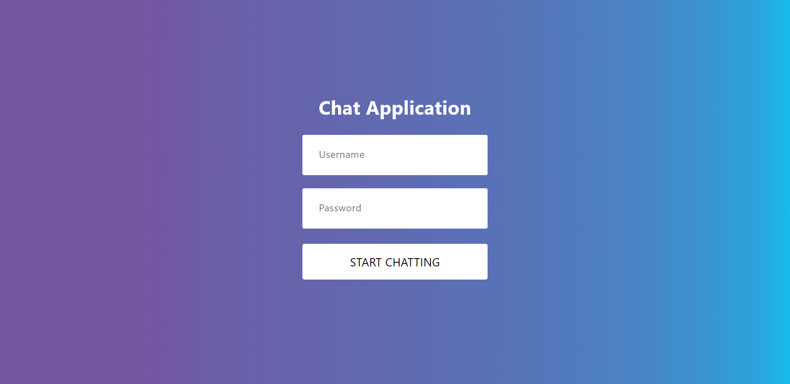
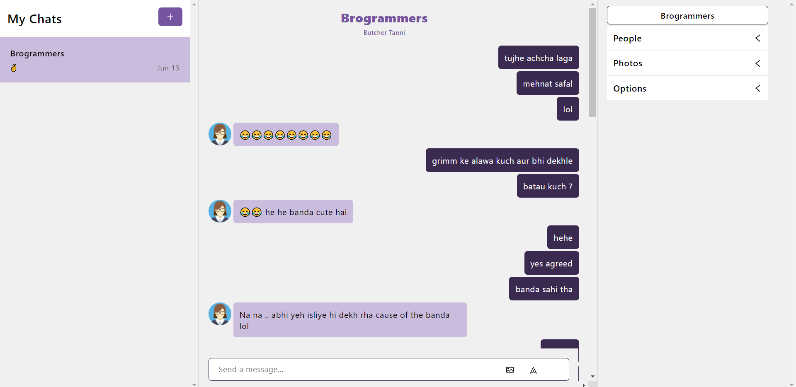

# Title 

RCHAT-APP

## Purpose

As now more than 70% of total visits on top digital news websites come from mobile devices, the need for developing chat apps has escalated.  

A lot of traffic and referrals observed on news organizations belong to social platforms, which translates into a great opportunity for relationship building and audience engagement. 

Chat messengers present themselves as representatives of socials on mobile and drive the size of traffic too huge to ignore. 

rchat-app is a group chat application with a user friendly interface that provides instant messaging using socket.io . 

## What's Inside ?

 

## Have a Look :-

https://r-chat-app.netlify.app/

## Installation

#### Running locally
Make sure ou have Node.js and npm install.
  
  1. Clone or Download the repository
     <pre>git clone https://github.com/PrSi007/rchat-app.git
     $ cd rchat-app</pre>
  
  2. Install Dependencies
      <pre>npm install</pre>
      
## Credits

 1. JavaScipt Mastery 
 2. Net Ninja

      
    

